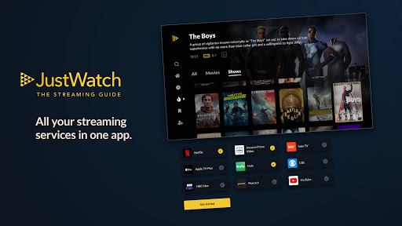

# JustWatch Web Scraping

## Overview
This project aims to scrape JustWatch to gather information about movies and TV shows released after 2000. It then filters out movies and TV shows released before 2022 with an IMDb rating below 7. Finally, it generates word clouds for the top 5 streaming services and genres based on the filtered data.

## Problem Statement
The goal of this project is to:

* Scrape 100 URLs of movies and TV shows released after 2000 from JustWatch.
* Extract data such as title, release year, genre, IMDb rating, and streaming services for each URL.
* Filter out movies and TV shows released before 2022 with an IMDb rating below 7.
* Generate word clouds for the top 5 streaming services and genres based on the filtered data.

## Datasets
**Movies Dataset**: Contains data for movies scraped from JustWatch, including title, release year, genre, IMDb rating, and streaming services. 
https://drive.google.com/file/d/1WimS_XonOSHgOsAZU-aP_nWbvJMmgR_o/view?usp=drive_link

**TV Shows Dataset**: Contains data for TV shows scraped from JustWatch, including title, release year, genre, IMDb rating, and streaming services.
https://drive.google.com/file/d/1AFkJiFhAvbxG8k5AzUZJtaU5taTtS2d2/view?usp=drive_link

**Filtered Movies**: Subset of the movies dataset containing only movies released after 2000 with an IMDb rating of 7 or higher and released before 2022.
https://drive.google.com/file/d/1Xyay27Tum1AMNw-z32gT9eb5s8Jmom2W/view?usp=drive_link

**Filtered TV Shows Dataset**: Subset of the TV shows dataset containing only TV shows released after 2000 with an IMDb rating of 7 or higher and released before 2022.
https://drive.google.com/file/d/1C3Jf7LIitWj3aDTvVI7TC0xjujdyLjjl/view?usp=drive_link

For the Complete work you can access : https://drive.google.com/drive/folders/1-qLJ2YWkEH0GBDatVeGDzDBH1el20CPW?usp=drive_link

Connect with me : https://www.linkedin.com/in/gaurob-buragohain-a6477a187/
